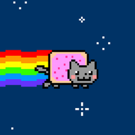
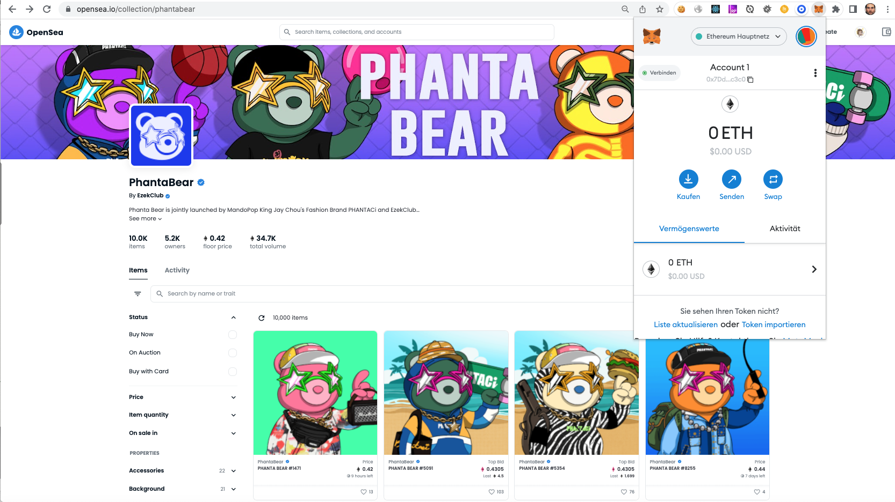

# NFT
## What are NFTs?
NFT stands for *Non-fungible Tokens*. NFTs are smart contracts deployed on a blockchain that represent something *unique*. Unlike our `helloworld` contract which is fungible (i.e. replaceable, interchangable), NFTs are unique.  Technically NFTs follow a different standard, the so called `ERC721` standard. Fungible tokens in contrast follow the `ERC20` standard.

*For example: the dollar bill in your wallet is **fungible**: it might has a serial number and a print date but every bill is interchangeable. You can use it for buying goods, pocket money for your kid or put into a safe (for future use). But whatever you do you are only interested in the value - not in this particular bill. In other words: nobody keeps record about who used this bill for what. 
The picture you took on your smart phone is **non-fungible**: although you can send it to other people, post it on social media, sell it, ... you will always remain the creator of that image and the blockchain stores your address (and any future owner).*

## What are NFTs for?
Because NFTs are non-fungible they provide proof of ownership or coypright to the owner: everybody can see who created that NFT, where did it come from, who owned it and who is the current owner. Most NFTs are used for arts, video games, music, films, etc.

Beside this, NFTs are still smart contract, i.e. they can have additional functionality. 
Think for example about a piece of art that pays the artist a small fraction of the selling price whenever it changes ownership. You can a function within your NFT contract which exactly does this.

Legally, the ownership of an NFT does not inherently grant copyright or intellectual property rights to the digital asset the NFT is linked to, but it provides evidence of ownership of that token.

## Example of NFTs
Probably the most famous NFT is the [Nyan cat](https://en.wikipedia.org/wiki/Nyan_Cat): a simple but popular animation uploaded on [Youtube](https://youtu.be/QH2-TGUlwu4) in 2011. Ten years later the creator sold it as a non-fungible token (NFT) for 300 ether, the equivalent of US$587,000 at the time of sale.   


But NFTs can also be physical objects as you can link the token literarlly to anything. Some real estate companies already sell houses where the buyer of the house gets an NFT linked to the ownership of an LLC that owns the physical asset, not the housing deed itself.<a name="cite_ref-1"></a>[<sup>[1]</sup>](#cite_note-1) 

An example for NFTs used as collectible and as a membership is the famous [Bored Apes](https://www.gemini.com/cryptopedia/what-is-bored-ape-yacht-club-nft-bored-apes#section-how-to-buy-a-bored-ape): a collection of 10,000 Ethereum-based NFTs that launched in 2021. These Ape NFT caricatures feature various facial expressions, clothes, and unique elements and provide membership to the *Bored Ape Yacht Club* with private online spaces, exclusive merch, and members-only live events.   


>📝  NFTS are **uniqe** - they are smart contracts following the `ERC721` standard.
## NFTs and the future of the internet
You might heard about `web1.0`, `web 2.0` and `web 3.0`? In plain simple terms: 
- `Web 1.0` was the beginning of the internet: we had blogs, homepages, company websites, wikipedia, e-commerce, etc. -  using the internet meant for most people *consuming content*.   
- `Web 2.0` added social media, involving the user into the creating-of-content process - internet then meant *prosuming* (consuming and producing at the same time). However, most user of social platformd did not benefit from their content (beside the fun of sharing and interacting most users did not got compensated for posting on Instagram or tweeting on Twitter) and platforms like Facebook and Google became the most-valuable companies in the world.   
- `Web 3.0` which technically started with the first introduction of blockchain in 2008 but in fact is about to shift the nature of the internet and is for many experts the future of the internet. Besides decentralicing content and therefore putting content into the hand of the *crowd* rather than in the hand of big companies and/or governments (at this point is funny if you think about what the original purpose of the interent was: a decentraliced network owned by the people), it also gives the user the possility to own and monetize his/her content. Although smart contracts based on ERC20 standard also belong to `Web 3.0` the idea of non-fungibality and NFTs is so central to this new internet world that we mention it here.
>📝   Web3.0 let you own and monetize your content - it's the future of the internet.

## The nature of NFTs
Although you could technically store your *digital art* directly on the blockchain (i.e. `onchain`) it would cost too much `gas` (👉🏻 *`gas` is the transaction fee for uploading/changing contracts on the blockchain*). Instead the NFT contains an `URI`. A URI ("Universal Resource Identifier") is a string containing characters that identify a physical or logical resource. URI follows syntax rules to ensure uniformity. Moreover, it also mantains extensibilitiy via a chierarchical naming scheme.

Every NFT has a unique owner: ```mapping (uint256 => address) private _owners;``` and in addition they have what is called a `TokenURI`. Each token is unique and each tokenID represents a unique asset. If we want to visualize these assets we need to define some attributes, e.g. how does the art looks like, what are the stats of a gaming character, etc.
This is were `Metadata` and `TokenURI` come into play. The metadata describes the character of the NFT. The simplest metadata might look like this:   
``` 
"name": "Name",
"description": "Description",
"image": "URI",
"attributes": []
```
"Image" refers to a seperate URI that points to an image.

Metadata can be stored on-chain or off-chain. The problem with on-chain metadata is that many NFT marketplaces don't know how to read the metadata from the contract. *(But if you want your token to interact with other tokens you need to store it on-chain.)*


### `IPFS`
[IPFS](https://ipfs.io) stands for InterPlanetary File System: *"a peer-to-peer hypermedia protocol designed to preserve and grow humanity's knowledge by making the web upgradeable, resilient, and more open"* (according to their website). It allows anyone to upload a file (e.g. image) which then will be hashed so that if the file change, the hash will change - allowing to track any changes to your file.

The process to link your NFTs metadata to IPFS:
1. Get IPFS
2. AddTokenURI json file to IPFS
3. Add IPFS URI to your NFT URI


# NFT Marketplaces
The easiest way to buy, sell, and even make an NFT is to use a platform like [Opensea](https://opensea.io/), [Rarible](https://rarible.com/), or [Mintible](https://mintable.app/). We highly recommend you to explore the Opensea marketplace. It will give you valuable insights about how the NFT market works. You can also open an account and connect your Metamask wallet and start trading NFTs:    


*(⬆ `PhantaBear` NFTs on [Opensea](https://opensea.io/collection/phantabear) connected to `Metamask` wallet)*

But of course with any other platform you are bound to their functionality (and prices). In the following section we show you the basics of minting an NFT completely by yourself. And in our weekly *Workbook* you will mint your own NFT.

---
# 📚 References
<a name="cite_note-1"></a>1. [^](#cite_ref-1) CoinDesk 2022: *NFT-Linked House Sells for $650K in Propy’s First US Sale*, [URL](https://www.coindesk.com/business/2022/02/11/nft-linked-house-sells-for-650k-in-propys-first-us-sale/)

### *And if you want to dig deeper ...*
Patrick Collins 2012: Build, Deploy, and Sell Your Own Dynamic NFT, [URL](https://blog.chain.link/build-deploy-and-sell-your-own-dynamic-nft/)